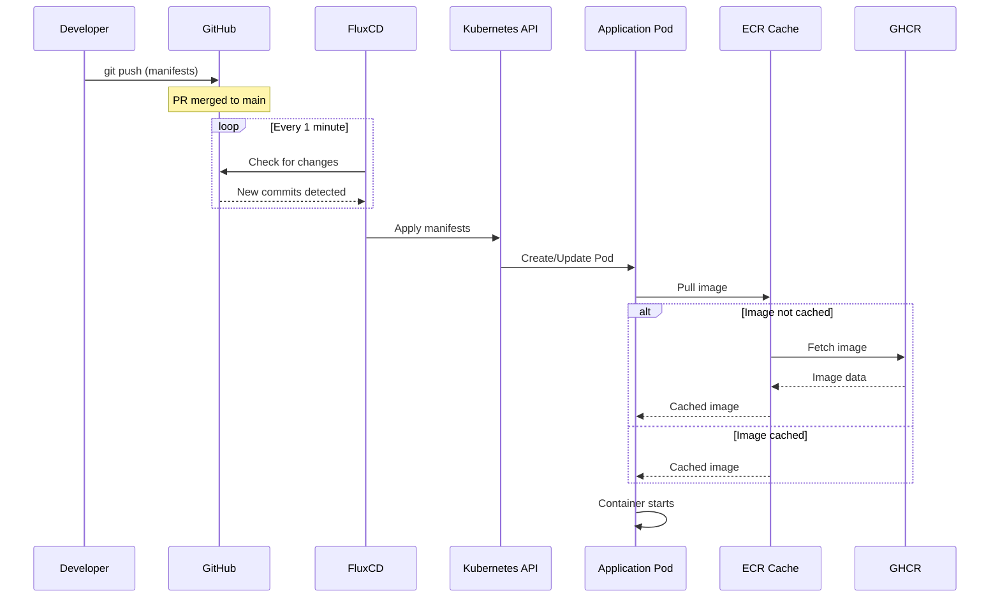
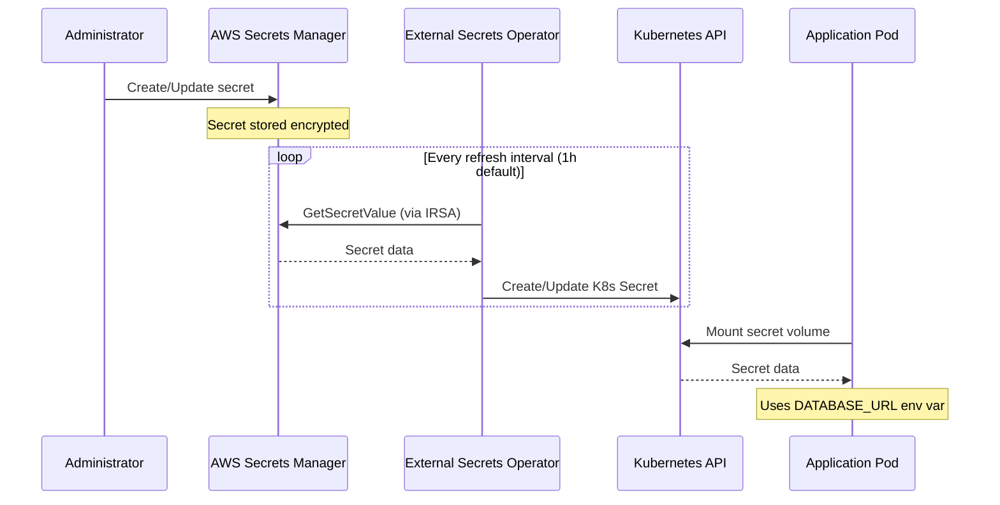
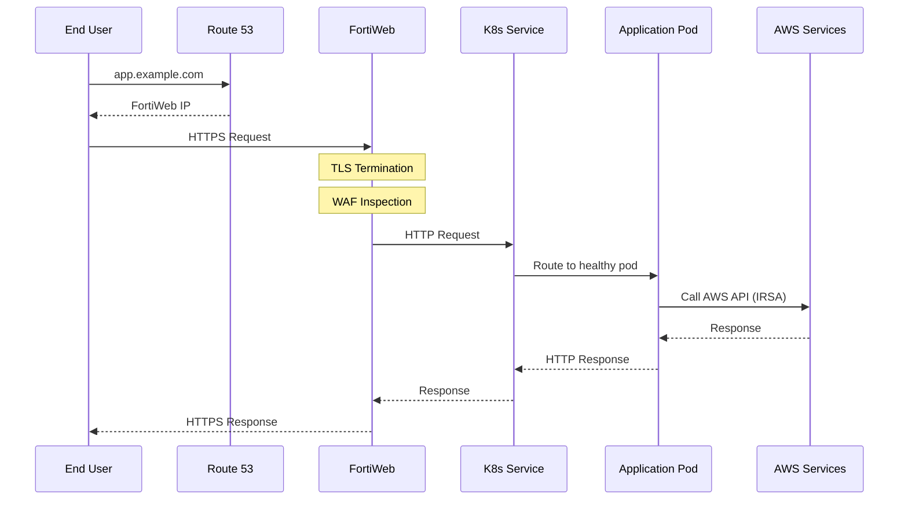
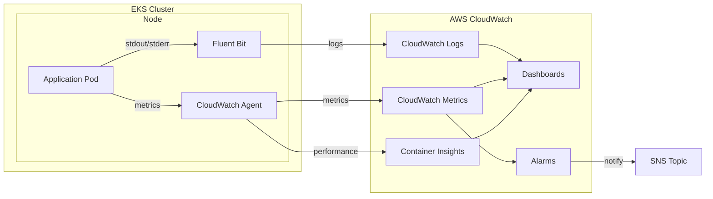
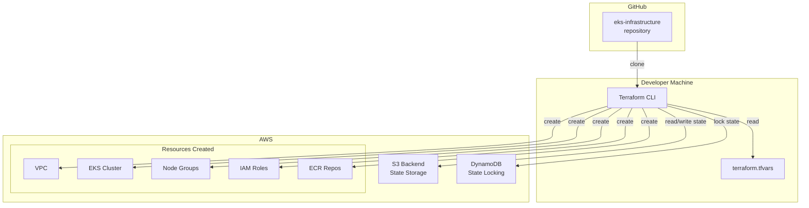
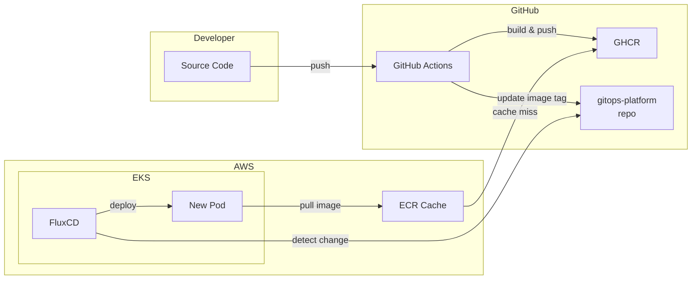

# Data Flow Diagrams

## Deployment Flow (GitOps)

## Secret Synchronization Flow

## Request Flow (Ingress)

## Observability Flow

## Infrastructure Provisioning Flow

## Image Build and Deploy Flow

## Key Flow Characteristics

| Flow | Trigger | Latency | Failure Mode |
|------|---------|---------|--------------|
| **Deployment** | Git push | 1-5 minutes | FluxCD retry with backoff |
| **Secret Sync** | Scheduled (1h) | Near-instant | ESO retry, K8s secret unchanged |
| **Request** | User action | <100ms (target) | FortiWeb failover, pod restart |
| **Observability** | Continuous | 1-5 minutes | Buffer in Fluent Bit |
| **Infrastructure** | Manual | 10-30 minutes | Terraform state rollback |
