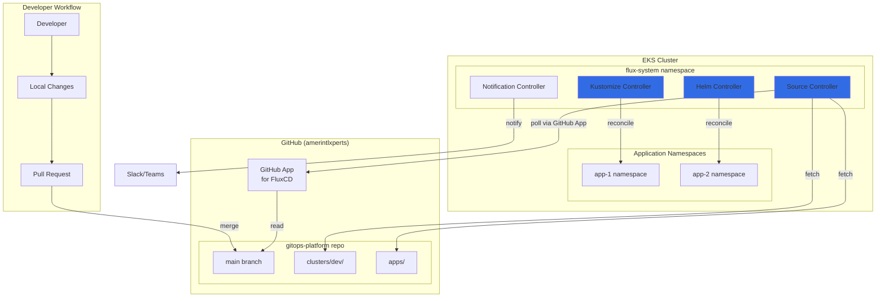
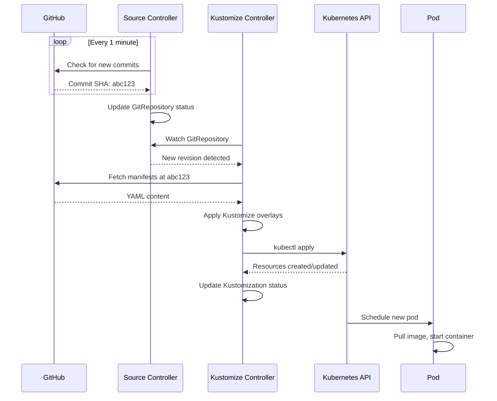
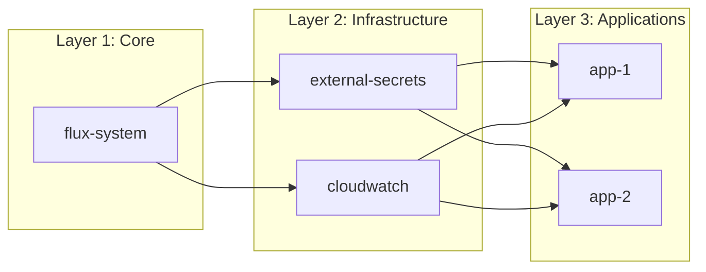
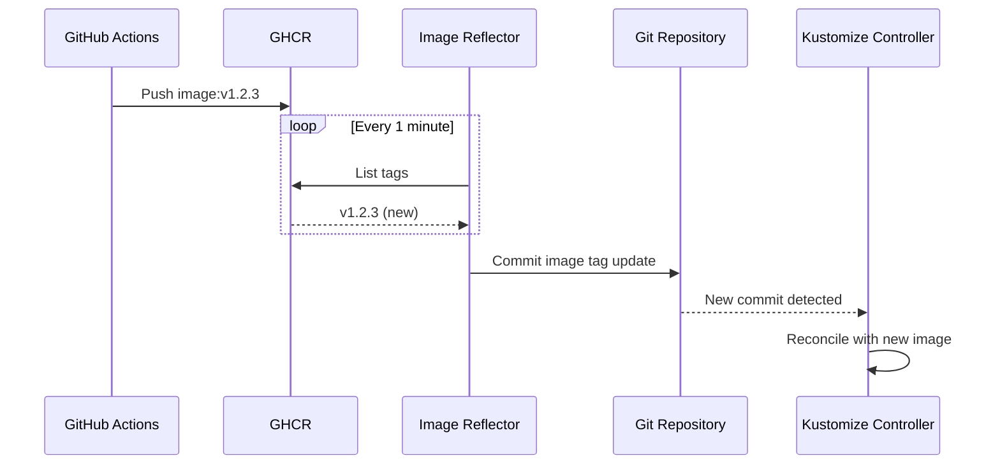

# GitOps Flow

## Overview



## FluxCD Components

### Source Controller
- Polls Git repositories for changes
- Authenticates via GitHub App
- Creates `GitRepository` resources with commit info

### Kustomize Controller
- Watches `Kustomization` resources
- Applies Kustomize overlays
- Handles plain YAML and Kustomize

### Helm Controller
- Watches `HelmRelease` resources
- Renders and applies Helm charts
- Supports values from ConfigMaps/Secrets

### Notification Controller
- Sends alerts on reconciliation events
- Supports Slack, Teams, webhooks
- Tracks deployment status

## Repository Structure

```mermaid
graph TB
    subgraph "gitops-platform repository"
        ROOT[/]

        subgraph "clusters/"
            DEV[dev/]
            DEV_FLUX[flux-system/]
            DEV_INFRA[infrastructure/]
            DEV_APPS[apps/]
        end

        subgraph "apps/"
            APP1_DIR[app-1/]
            APP1_BASE[base/]
            APP1_DEV[overlays/dev/]

            APP2_DIR[app-2/]
        end

        subgraph "infrastructure/"
            ESO_DIR[external-secrets/]
            CW_DIR[cloudwatch/]
        end
    end

    ROOT --> DEV
    DEV --> DEV_FLUX
    DEV --> DEV_INFRA
    DEV --> DEV_APPS

    ROOT --> APP1_DIR
    APP1_DIR --> APP1_BASE
    APP1_DIR --> APP1_DEV
    ROOT --> APP2_DIR

    ROOT --> ESO_DIR
    ROOT --> CW_DIR
```

## Reconciliation Flow



## Key Resources

### GitRepository
```yaml
apiVersion: source.toolkit.fluxcd.io/v1
kind: GitRepository
metadata:
  name: gitops-platform
  namespace: flux-system
spec:
  interval: 1m
  url: https://github.com/amerintlxperts/gitops-platform
  ref:
    branch: main
  secretRef:
    name: github-app-credentials
```

### Kustomization (Cluster Bootstrap)
```yaml
apiVersion: kustomize.toolkit.fluxcd.io/v1
kind: Kustomization
metadata:
  name: infrastructure
  namespace: flux-system
spec:
  interval: 10m
  sourceRef:
    kind: GitRepository
    name: gitops-platform
  path: ./clusters/dev/infrastructure
  prune: true
  wait: true
```

### Kustomization (Application)
```yaml
apiVersion: kustomize.toolkit.fluxcd.io/v1
kind: Kustomization
metadata:
  name: app-1
  namespace: flux-system
spec:
  interval: 5m
  sourceRef:
    kind: GitRepository
    name: gitops-platform
  path: ./apps/app-1/overlays/dev
  prune: true
  dependsOn:
    - name: infrastructure
```

### HelmRelease (for Helm charts)
```yaml
apiVersion: helm.toolkit.fluxcd.io/v2beta1
kind: HelmRelease
metadata:
  name: external-secrets
  namespace: external-secrets
spec:
  interval: 1h
  chart:
    spec:
      chart: external-secrets
      version: "0.9.x"
      sourceRef:
        kind: HelmRepository
        name: external-secrets
        namespace: flux-system
  values:
    serviceAccount:
      annotations:
        eks.amazonaws.com/role-arn: arn:aws:iam::ACCOUNT:role/eso-role
```

## Dependency Management



Dependencies are declared in Kustomization resources:
```yaml
spec:
  dependsOn:
    - name: external-secrets
    - name: cloudwatch
```

## Image Update Automation (Optional)



### Image Policy (if using image automation)
```yaml
apiVersion: image.toolkit.fluxcd.io/v1beta1
kind: ImagePolicy
metadata:
  name: app-1
spec:
  imageRepositoryRef:
    name: app-1
  policy:
    semver:
      range: '>=1.0.0'
```

## Notification Setup

```yaml
apiVersion: notification.toolkit.fluxcd.io/v1beta1
kind: Provider
metadata:
  name: slack
  namespace: flux-system
spec:
  type: slack
  channel: deployments
  secretRef:
    name: slack-webhook
---
apiVersion: notification.toolkit.fluxcd.io/v1beta1
kind: Alert
metadata:
  name: deployment-alerts
  namespace: flux-system
spec:
  providerRef:
    name: slack
  eventSeverity: info
  eventSources:
    - kind: Kustomization
      name: '*'
    - kind: HelmRelease
      name: '*'
```

## Troubleshooting Commands

```bash
# Check FluxCD status
flux get all

# Check specific resource
flux get kustomizations
flux get helmreleases -A

# Force reconciliation
flux reconcile kustomization app-1

# View logs
kubectl logs -n flux-system deploy/source-controller
kubectl logs -n flux-system deploy/kustomize-controller

# Suspend/resume
flux suspend kustomization app-1
flux resume kustomization app-1
```

## GitOps Best Practices

1. **Never modify cluster directly** - All changes through Git
2. **Use Kustomize overlays** - Base configs with environment patches
3. **Declare dependencies** - Ensure correct reconciliation order
4. **Enable pruning** - Remove resources deleted from Git
5. **Set health checks** - Wait for resources to be ready
6. **Use semantic versioning** - For Helm chart and image versions
7. **Encrypt secrets reference** - Never plain secrets in Git
