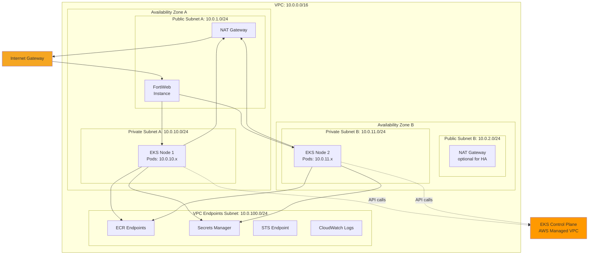
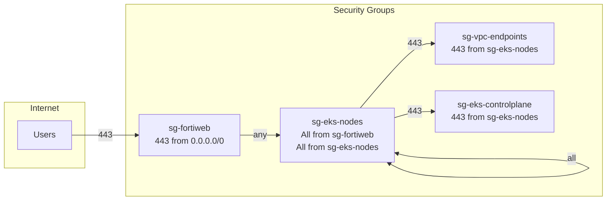
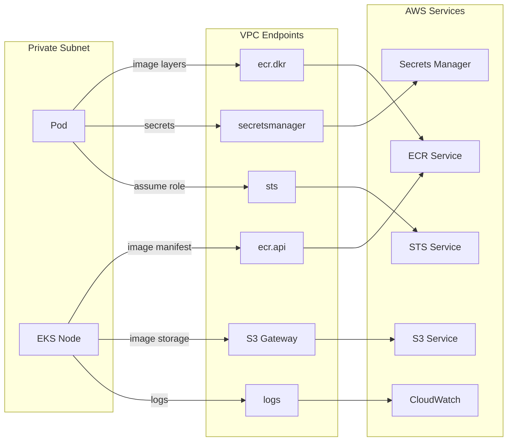
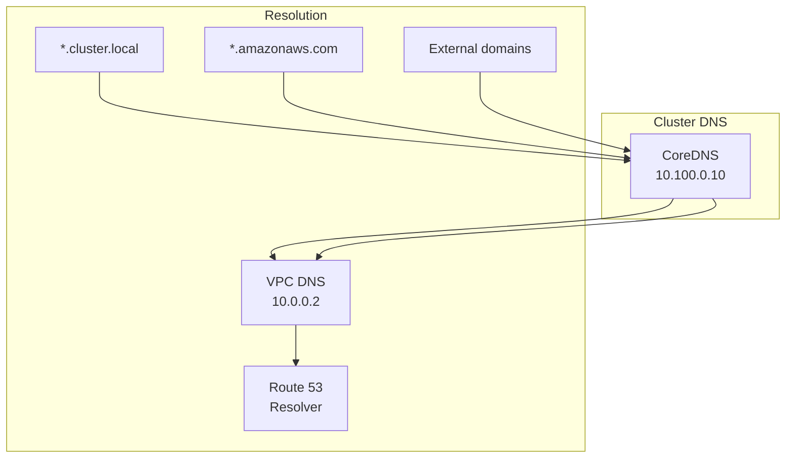

# Network Architecture

## VPC Design



## Subnet Allocation

| Subnet Type | CIDR | AZ | Purpose |
|-------------|------|-----|---------|
| Public A | 10.0.1.0/24 | ca-central-1a | NAT Gateway, FortiWeb |
| Public B | 10.0.2.0/24 | ca-central-1b | (Reserved for HA) |
| Private A | 10.0.10.0/24 | ca-central-1a | EKS nodes, pods |
| Private B | 10.0.11.0/24 | ca-central-1b | EKS nodes, pods |
| VPC Endpoints | 10.0.100.0/24 | Multi-AZ | Interface endpoints |

## Security Groups



### Security Group Rules Detail

**sg-fortiweb (FortiWeb)**
| Direction | Port | Source/Dest | Purpose |
|-----------|------|-------------|---------|
| Inbound | 443 | 0.0.0.0/0 | HTTPS from internet |
| Inbound | 80 | 0.0.0.0/0 | HTTP redirect (optional) |
| Outbound | All | sg-eks-nodes | Traffic to nodes |

**sg-eks-nodes (Node Group)**
| Direction | Port | Source/Dest | Purpose |
|-----------|------|-------------|---------|
| Inbound | All | sg-fortiweb | Traffic from ingress |
| Inbound | All | sg-eks-nodes | Pod-to-pod traffic |
| Inbound | 443 | EKS Control Plane | Kubelet API |
| Inbound | 10250 | EKS Control Plane | Kubelet metrics |
| Outbound | 443 | sg-vpc-endpoints | AWS API calls |
| Outbound | 443 | 0.0.0.0/0 | Internet (via NAT) |

**sg-vpc-endpoints (VPC Endpoints)**
| Direction | Port | Source/Dest | Purpose |
|-----------|------|-------------|---------|
| Inbound | 443 | sg-eks-nodes | AWS API calls |

## VPC Endpoints



### VPC Endpoints Required

| Endpoint | Type | Purpose |
|----------|------|---------|
| `com.amazonaws.ca-central-1.ecr.api` | Interface | ECR API calls |
| `com.amazonaws.ca-central-1.ecr.dkr` | Interface | Docker registry protocol |
| `com.amazonaws.ca-central-1.s3` | Gateway | ECR image layer storage |
| `com.amazonaws.ca-central-1.secretsmanager` | Interface | Secrets Manager access |
| `com.amazonaws.ca-central-1.sts` | Interface | STS for IRSA |
| `com.amazonaws.ca-central-1.logs` | Interface | CloudWatch Logs |
| `com.amazonaws.ca-central-1.ec2` | Interface | EC2 API (node management) |

## Network Flow Paths

### Pod to AWS Service (Private)
```
Pod → Node ENI → VPC Endpoint ENI → AWS Service
(Stays within VPC, no NAT required)
```

### Pod to Internet (Outbound)
```
Pod → Node ENI → NAT Gateway → Internet Gateway → Internet
(Required for: GitHub API, external APIs)
```

### Internet to Pod (Inbound)
```
Internet → Internet Gateway → FortiWeb → Node ENI → Pod
(All external traffic via FortiWeb WAF)
```

### Pod to Pod (Same Node)
```
Pod A → veth → cbr0 bridge → veth → Pod B
(Local traffic, no network hop)
```

### Pod to Pod (Different Nodes)
```
Pod A → veth → Node A ENI → VPC routing → Node B ENI → veth → Pod B
(Uses VPC CNI, native VPC networking)
```

## DNS Configuration



| Domain Pattern | Resolution |
|----------------|------------|
| `*.cluster.local` | CoreDNS (cluster services) |
| `*.ca-central-1.amazonaws.com` | VPC DNS → VPC Endpoint |
| `*.github.com` | VPC DNS → Internet (via NAT) |
| `app.example.com` | Route 53 (if internal) |

## IP Address Management

| Resource | IP Range | Count |
|----------|----------|-------|
| VPC CIDR | 10.0.0.0/16 | 65,536 |
| Public subnets | 10.0.1-2.0/24 | 512 (2x256) |
| Private subnets | 10.0.10-11.0/24 | 512 (2x256) |
| VPC endpoints | 10.0.100.0/24 | 256 |
| Pod IPs (per node) | Secondary ENI IPs | ~17 per t3.medium |
| Service CIDR | 10.100.0.0/16 | 65,536 (cluster internal) |

## Cost Considerations

| Component | Monthly Cost | Notes |
|-----------|-------------|-------|
| NAT Gateway | ~$32 + data | Single NAT for dev |
| VPC Endpoints (7) | ~$52 | $7.30/endpoint/month |
| Data transfer | Variable | VPC endpoint traffic free |

### Cost Optimization Options
1. Use single NAT Gateway (vs HA pair) for dev
2. Combine endpoints where possible
3. Use S3 Gateway endpoint (free) vs Interface
4. Route internal traffic through endpoints to avoid NAT data costs
