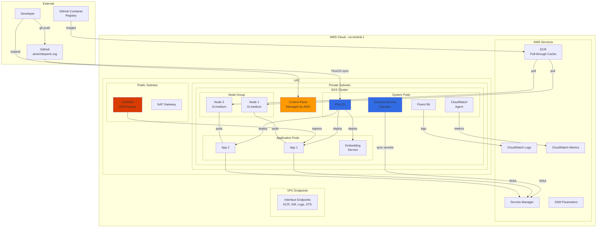

# System Overview Diagram

## High-Level Architecture

## Component Descriptions

### External Components

| Component | Purpose |
|-----------|---------|
| **Developer** | Interacts via kubectl and git |
| **GitHub (amerintlxperts)** | Hosts infrastructure and GitOps repositories |
| **GHCR** | Source container registry for application images |

### VPC Components

| Component | Purpose |
|-----------|---------|
| **FortiWeb** | WAF and ingress controller, routes external traffic |
| **NAT Gateway** | Outbound internet access for nodes |
| **EKS Control Plane** | Managed Kubernetes API server |
| **Node Group** | EC2 instances running pods |

### System Pods

| Component | Purpose |
|-----------|---------|
| **FluxCD** | GitOps operator, syncs from GitHub |
| **External Secrets Operator** | Syncs secrets from AWS Secrets Manager |
| **CloudWatch Agent** | Collects container metrics |
| **Fluent Bit** | Ships logs to CloudWatch Logs |

### AWS Services

| Service | Purpose |
|---------|---------|
| **ECR** | Container registry with GHCR pull-through cache |
| **Secrets Manager** | Stores application secrets |
| **CloudWatch** | Logs, metrics, and monitoring |
| **SSM Parameters** | Non-sensitive configuration values |

## Data Flow Summary

1. **Deployment Flow**: Git push → GitHub → FluxCD → Kubernetes API → Pods
2. **Image Pull Flow**: GHCR → ECR (cache) → Node → Pod
3. **Secret Flow**: Secrets Manager → ESO → Kubernetes Secret → Pod
4. **Ingress Flow**: Internet → FortiWeb → Service → Pod
5. **Observability Flow**: Pod → Fluent Bit/CW Agent → CloudWatch
